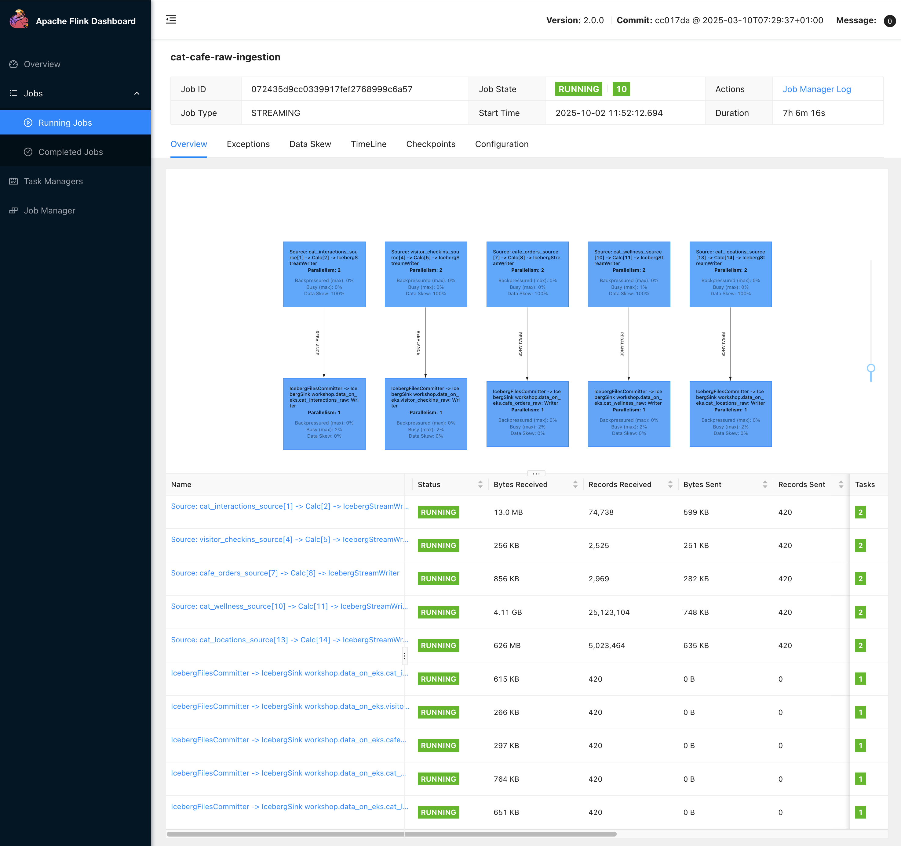
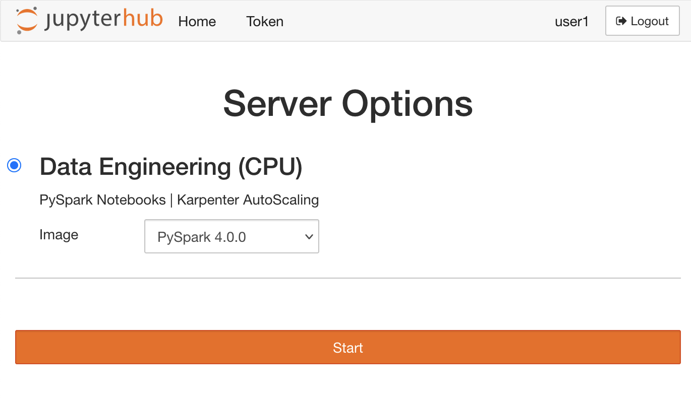
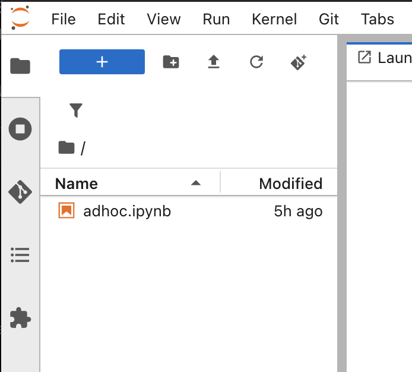
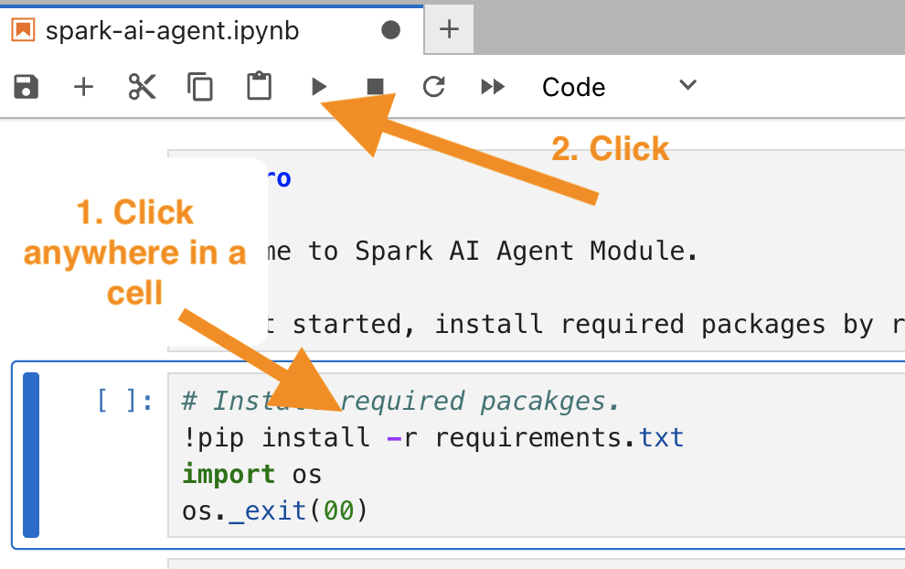
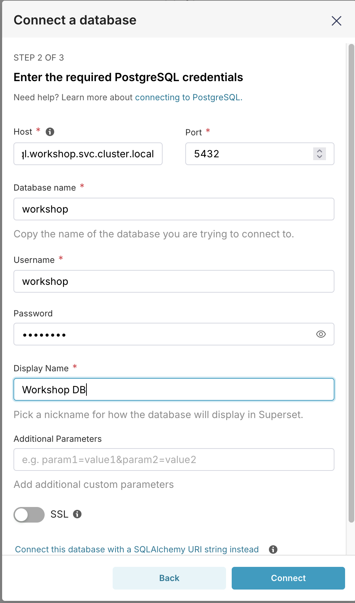
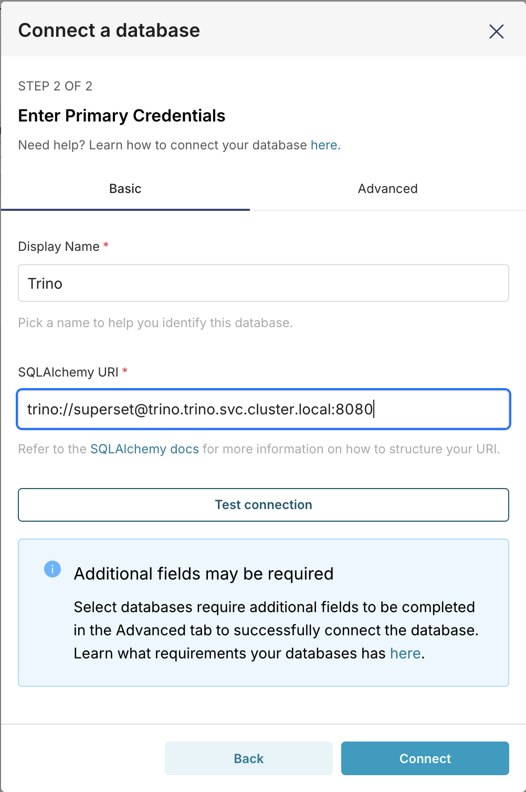

# DoEKS Cat Cafe: Real-Time Data Platform Workshop

Build a complete streaming data platform using the story of managing a modern cat cafe. This hands-on workshop covers the full data engineering stack, from real-time event processing to historical analytics, all deployed on Kubernetes.

## What You'll Build

An open source data platform that:
- Ingests live events from cafe operations (cat interactions, wellness monitoring, visitor activity)
- Processes data streams in real-time to generate alerts and insights
- Stores all data in a modern lakehouse architecture for historical analysis
- Provides live dashboards and business intelligence reports

## What You'll Learn

* **Event Streaming:** Apache Kafka as the backbone for real-time data flows
* **Stream Processing:** Apache Flink for stateless and stateful real-time analytics
* **Data Lakehouse:** Apache Iceberg on S3 for durable, queryable data storage
* **Batch Processing:** Apache Spark for large-scale data transformations
* **Cloud-Native Deployment:** Kubernetes operators for managing data infrastructure
* **Full-Stack Integration:** Connecting data pipelines to live web applications

## Prerequisites

- `kubectl` configured for your EKS cluster
- `uv` Python package manager installed
- Basic familiarity with Kubernetes concepts


## Architecture Overview

The platform follows a modern lakehouse architecture with both streaming and batch processing capabilities:

```
                                     +-----------------+
                                     |   PostgreSQL    |  (Source: Cat & Visitor Profiles)
                                     |      (DB)       |
                                     +-----------------+
                                         |         |
                              (Profile Lookups)|         | (Batch Dimension Ingestion)
                                         v         v
      +---------------------+        +-----------------+        +----------------+
      | Real-Time Producer  |------->|      Kafka      |        |   Batch Jobs   |
      | (event_producer.py) |        | (Event Broker)  |        |    (Spark)     |
      +---------------------+        +-----------------+        +----------------+
      (Generates: interactions,       (Topics: raw_events,         |         ^
       wellness, checkins)            alerts)                      |         |
                 |                            | (Alerts)           | (Analytics & Aggregates)
                 | (Raw Events)               |                    v         |
                 v                            v             +-----------------+
      +---------------------+        +-----------------+    |   Iceberg Lake  |
      |   Streaming Jobs    |------->|   Alert UI      |    |      (S3)       |
      |     (Flink)         |        |   (WebSocket)   |    +-----------------+
      +---------------------+        +-----------------+         ^        |
      (Raw Ingestion, Health         (Consumes alerts            |        |
       monitoring, adoption detection)   from Kafka)             |        v
                 |                                              +---------------+
                 '----------------------------------------------| BI Dashboard  |
                           (Writes raw events to Lake)          |  (Superset)   |
                                                                +---------------+
```

## Workshop Modules

## Module 1: Data Generation & Kafka Ingestion

**Goal:** Set up the cafe's operational database and start generating live event streams to Kafka.

### Step 1: Deploy PostgreSQL Database

Deploy the cafe's operational database containing cat and visitor profiles:

```bash
# Update kubeconfig to use the created cluster
aws eks update-kubeconfig --name  data-on-eks --alias data-on-eks

export WORKSHOPDIR=$(git rev-parse --show-toplevel)/data-stacks/workshop

kubectl apply -f $WORKSHOPDIR/manifests/postgresql.yaml
```

Wait for the pod to be ready:
```bash
kubectl wait --for=condition=ready pod/postgresql-0 -n workshop --timeout=300s
```


### Step 2: Generate Sample Data

Create cat and visitor data in the database:

In another terminal open port-forward:

```bash
# Port-forward to PostgreSQL
kubectl port-forward postgresql-0 5432:5432 -n workshop
```

Go back to the first terminal, then generate data

```bash
# Generate sample data
cd $WORKSHOPDIR/src/data-flow
uv sync --frozen
uv run data-generator.py
```

In the second terminal, kill the port-forward process by pressing `ctrl + c`. 


**Validate:** Check that data was created:

```bash
# Connect to database
kubectl exec -it postgresql-0 -n workshop -- psql -U workshop

# Run these queries in psql:
SELECT COUNT(*) FROM cats;
SELECT COUNT(*) FROM visitors;
\q
```

You should see ~11,000 cats and ~1,000 visitors.

### Step 3: Create Kafka Resources

First, deploy the Kafka cluster provided by the Strimzi operator.

```bash
kubectl apply -f $WORKSHOPDIR/manifests/kafka-cluster.yaml
```

**Validate:** Wait for the Kafka cluster to be ready. This will take a few minutes because
nodes are provisioned by Karpenter on demand. Karpenter needs to create new instances and register them for use by the cluster.

```bash
# Verify nodeclaims are created
kubectl get nodeclaim

kubectl wait kafka/cluster --for=condition=Ready -n kafka --timeout=300s

# Once the Kafka cluster is ready, the nodeclaims should alo be ready
kubectl get nodeclaim
```

Next, set up the event streaming topics required for the workshop:

```bash
kubectl apply -f $WORKSHOPDIR/manifests/topics.yaml
```

**Validate:** Check that the `KafkaTopic` resources were created successfully in the `kafka` namespace.
```bash
kubectl get kafkatopics -n kafka
```

The following topics will be created:

| Topic Name             | Purpose                                            |
|------------------------|----------------------------------------------------|
| `cat-interactions`     | Raw events of visitors interacting with cats.      |
| `cat-wellness-iot`     | Raw IoT sensor data from cat wellness monitors.    |
| `visitor-checkins`     | Raw events generated when a visitor checks in.     |
| `cat-health-alerts`    | Alerts generated for cats showing health issues.   |
| `potential-adopters`   | Alerts for visitors showing strong adoption intent.|


### Step 4: Start Event Generation

Deploy a producer pod which will be used to generate live events:

```bash
kubectl apply -f $WORKSHOPDIR/manifests/event-producer.yaml
```

Connect to the producer pod and start the event generator script. The script will run in the background.

```bash
# Exec into the pod
kubectl exec -it event-producer -n workshop -- bash

# Inside the pod, run the following commands: 
apt update && apt install -y git curl
curl -LsSf https://astral.sh/uv/install.sh | sh
source ~/.bashrc

# Clone the repo and navigate to the correct directory
git clone https://github.com/awslabs/data-on-eks.git --depth 1 --branch v2
cd data-on-eks/data-stacks/workshop/src/data-flow

# Set environment variables for the script
export DB_HOST=postgresql-0.postgresql.workshop.svc.cluster.local
export KAFKA_BROKERS=cluster-broker-0.cluster-kafka-brokers.kafka.svc:9092

# Install dependencies and run the producer in the background
uv sync --frozen
nohup uv run event-producer.py &
```

After running the `nohup` command, you can safely exit the pod shell. The process will continue running. You should see output like `Sent interaction event for cat_id=1234, visitor_id=567` printed to a `nohup.out` file.

### Step 5: Verify Event Streaming

To verify that events are flowing correctly, deploy a separate debug pod that contains the Kafka command-line tools:

```bash
kubectl apply -f $WORKSHOPDIR/manifests/kafka-debug-pod.yaml
```

Once the pod is running, use it to consume messages from the `cat-interactions` topic. The `--from-beginning` flag ensures you see all messages in the topic from the start.

```bash
kubectl exec -it kafka-debug -n workshop -- \
  kafka-console-consumer \
  --bootstrap-server cluster-broker-0.cluster-kafka-brokers.kafka.svc:9092 \
  --topic cat-interactions \
  --from-beginning
```

You should see a continuous stream of JSON events, confirming that the producer is working correctly.

**Success Criteria:**
- PostgreSQL contains cat and visitor data
- Kafka topics are created
- Events are being produced to `cat-interactions`, `cat-wellness-iot`, and `visitor-checkins` topics

---


## Module 2: Raw Data Ingestion to Iceberg

**Goal:** Deploy a Flink job that continuously reads all Kafka events and writes them to Iceberg tables in S3, creating a permanent data lake.

**Why this matters:** You're establishing the foundation for historical analytics by ensuring all raw data is durably stored. Your real-time data isn't just for immediate alerts—it's also building a massive historical archive automatically, with no complex ETL pipelines.

### Step 1: Update S3 Configuration

Update the S3 bucket name in the Flink deployment files:

```bash
export S3_BUCKET=$(terraform -chdir=/home/ubuntu/data-on-eks/data-stacks/workshop/terraform/_local output -raw s3_bucket_id_spark_history_server)
```

### Step 2: Deploy Raw Ingestion Flink Job

Deploy the Flink job that ingests raw events to Iceberg:

```bash
export DATAHUB_TOKEN=abc
bash deploy-flink.sh
```

**Validate:** Check the Flink deployment:
```bash
kubectl get flinkdeployments -n flink-team-a
```

You should see `cat-cafe-raw-ingestion` in `RECONCILING` state.

### Step 3: Monitor Flink Job

Check that the Flink pods are running:
```bash
kubectl get pods -n flink-team-a
```

Wait for both JobManager and TaskManager pods to be ready.

### Step 4: Access Flink UI

Port-forward to the Flink JobManager:
```bash
kubectl port-forward -n flink-team-a \
  svc/cat-cafe-raw-ingestion-rest 8081:8081
```

Open your browser to `http://localhost:8081` to view the Flink dashboard.



### Step 5: Verify Data Ingestion

In the Flink UI, you should see:
- A running job named "cat-cafe-raw-ingestion"
- Five source operators consuming from Kafka topics
- Five sink operators writing to Iceberg tables

**Check the job metrics:**
- Records consumed from each Kafka topic
- Records written to Iceberg tables
- No failures or restarts

Verify data is written to your S3 bucket

```bash
aws s3 ls s3://$S3_BUCKET/iceberg-warehouse/data_on_eks.db/cafe_orders_raw/
```

The output of this command should show `data` and `metadata` prefixes, which are created by Iceberg. This confirms that the Flink job is successfully writing data from the Kafka streams to the Iceberg table on S3. We will explore the structure of Iceberg tables in more detail in Module 5.

### What You Accomplished

You learned about Apache Iceberg's role as a modern data lakehouse format and deployed a Flink job that consumes from every raw Kafka topic (`visitor-checkins`, `cat-interactions`, `cat-wellness-iot`, etc) and sinks the data into corresponding Iceberg tables on S3.

**Key Takeaway:** You've created an automated pipeline that transforms streaming events into queryable historical data without complex ETL processes. Every event flowing through Kafka is now permanently stored and ready for future analytics.

**Success Criteria:**
- Flink deployment is in READY state
- Flink job is running without errors
- Data is flowing from Kafka topics to Iceberg tables
- Flink UI shows active consumption and ingestion metrics


## Module 3: Real-time Alerting with Flink

**Goal:** Deploy Flink jobs that analyze streaming data to generate intelligent alerts for cat health monitoring and adoption detection.

**Why this matters:** This is the brain of your real-time platform. You're building two distinct intelligence systems: a Cat Wellness Guardian that detects health anomalies, and an Adopter Detective that identifies potential cat adopters through behavioral analysis.

### Step 1: Deploy Alert Processing Jobs

Deploy the Flink jobs that process raw events and generate alerts:

```bash
export DATAHUB_TOKEN=abc
bash deploy-flink-alert.sh
```

This script defines and executes two Flink SQL jobs that run in parallel:

1.  **The Cat Wellness Guardian (Stateless):** This job consumes from the `cat-wellness-iot` topic. It applies simple filters to identify cats that are dehydrated (haven't had a drink in over 4 hours) or stressed (activity level is too low) and publishes the findings to the `cat-health-alerts` topic.
2.  **The Adopter Detective (Stateful):** This job consumes from the `cat-interactions` topic. It performs a stateful aggregation, keeping track of how many distinct cats a visitor has "liked." If a visitor likes more than three cats, the job publishes an alert to the `potential-adopters` topic.


**Validate:** Check both Flink deployments:
```bash
kubectl get flinkdeployments -n flink-team-a
```

You should see `cat-cafe-alerts` in `RECONCILING` state.

### Step 2: Monitor Alert Jobs

Check that the alert processing pods are running:
```bash
kubectl get pods -n flink-team-a -l app=cat-cafe-alerts
```

Wait for both JobManager and TaskManager pods to be ready.

### Step 3: Access Flink Alert UI

Port-forward to the alert job JobManager:
```bash
kubectl port-forward -n flink-team-a \
  svc/cat-cafe-alerts-rest 8082:8081
```

Open your browser to `http://localhost:8082` to view the alert processing dashboard.

### Step 4: Verify Alert Generation

In the Flink UI, you should see two running jobs:

**Cat Wellness Guardian (Stateless):**
- Filters `cat-wellness-iot` stream for anomalous readings
- Detects low activity or dehydration events
- Publishes alerts to `cat-health-alerts` topic

**Adopter Detective (Stateful):**
- Tracks visitor 'like' interactions over time
- Performs continuous aggregation to identify patterns
- Publishes potential adopters to `potential-adopters` topic

### Step 5: Test Alert Consumption

Verify alerts are being generated:
```bash
# Monitor health alerts
kubectl exec -it kafka-debug -n workshop -- \
  kafka-console-consumer \
  --bootstrap-server cluster-broker-0.cluster-kafka-brokers.kafka.svc:9092 \
  --topic cat-health-alerts \
  --from-beginning
```

### What You Accomplished

You built the brain of the real-time platform by deploying two distinct Flink SQL jobs that process raw streams and generate valuable, actionable alerts:

- **The Cat Wellness Guardian:** A stateless job that filters wellness IoT data for health anomalies
- **The Adopter Detective:** A stateful job that tracks visitor interactions and identifies adoption patterns

**Key Takeaway:** You experienced the power of Flink to analyze data in motion, handling both simple filtering and complex, stateful aggregations that remember past events. Your streaming platform now generates intelligent alerts from raw sensor data.

**Success Criteria:**
- Alert processing Flink deployment is in READY state
- Both wellness and adoption detection jobs are running
- Health alerts appear in `cat-health-alerts` topic
- Adoption alerts appear in `potential-adopters` topic
- Flink UI shows processing metrics for both jobs

---

## Module 4: Live Alert Dashboard

**Goal:** Deploy a web application that visualizes real-time alerts and demonstrates the complete data loop from events to UI.

**Why this matters:** This is where the platform comes to life. You're connecting abstract data processing to a tangible, human-facing interface that shows alerts in real-time and can even trigger actions back to the source systems.

### Step 1: Deploy the Web UI

Deploy the live dashboard application:

```bash
kubectl apply -f $WORKSHOPDIR/manifests/webui.yaml
```

**Validate:** Check the web UI deployment:
```bash
kubectl get pods -n workshop -l app=alert-ui
```

### Step 2: Access the Dashboard

Port-forward to the web application:
```bash
kubectl port-forward -n workshop svc/alert-ui 8788:8788
```

Open your browser to `http://localhost:8788`


### Step 3: Observe Real-time Alerts

In the dashboard, you should see:
- **Live Cafe Feed:** Real-time alerts appearing on the right side
- **Cat Status Grid:** Current status of all cats in the cafe
- **Alert Types:** Both health alerts and adoption notifications

### What You Accomplished

You deployed and accessed the "Live Dashboard" web application that consumes alerts from Kafka via WebSockets. You watched as health and adopter alerts generated by your Flink jobs appeared in the "Live Cafe Feed" in real-time.

**Key Takeaway:** The Flink jobs you wrote are now pushing notifications to a web browser, which can even influence the original data source. You've built a complete, interactive, end-to-end data loop.

**Success Criteria:**
- Web UI is accessible at localhost:8788
- Real-time alerts appear in the Live Cafe Feed
- Cat status updates reflect adoption events
- Dashboard shows both health and adoption alerts

---

## Module 5: Interactive Analysis and Batch Transformation with Spark

**Goal:** Use Spark in a Jupyter environment to interactively explore the Iceberg data lake, understand its powerful metadata features, and run a batch transformation job to create an aggregated summary table.

**Why this matters:** You're bridging the gap between raw data and business intelligence. This module shows how to leverage the historical data in your lakehouse for deeper analysis. You'll act as a data analyst, using Spark to query raw events, inspect table history, and build clean, aggregated tables that are perfect for BI dashboards.

### Step 1: Access JupyterHub

First, get access to the JupyterHub environment where you will run Spark.

Port-forward to the JupyterHub service:
```bash
kubectl port-forward -n jupyterhub svc/proxy-public 8000:80
```

Open your browser to `http://localhost:8000` and log in"

* Username: `user1`
* Password: `welcome`

### Step 2: Start Your Spark Environment

On the JupyterHub landing page, you'll be prompted to select a container image for your server.

1.  Select the **Spark 4.0** image from the dropdown menu.
2.  Click **Start**.

Karpenter will automatically provision a new node for your Spark environment. This may take 2-3 minutes.



### Step 3: Upload and Open the Notebook

Next, copy the workshop's analytics notebook into your running Jupyter environment.

```bash
POD_NAME=$(kubectl get pods -n jupyterhub -l app=jupyterhub,component=singleuser-server -o jsonpath='{.items[0].metadata.name}') && kubectl cp $WORKSHOPDIR/src/spark/adhoc.ipynb jupyterhub/$POD_NAME:/home/jovyan/adhoc.ipynb
```

Once the file is copied, you will see it in the Jupyter file browser on the left. Double-click `adhoc.ipynb` to open it.



### Step 4: Explore Iceberg's Power

The first part of the notebook guides you through the power of Iceberg's metadata. Follow the instructions to execute the cells and observe the output.

To execute a cell, click it and then press the **▶** button in the toolbar.



You will learn how to:
1.  **Connect to the Glue Catalog:** Configure Spark to use AWS Glue as the Iceberg catalog.
2.  **Inspect Data Files:** Use the `.files` metadata table to see the underlying Parquet files that make up your table. This reveals how Flink's streaming ingest created multiple small files.
3.  **View Table History:** Use the `.history` and `.snapshots` tables to get a complete audit trail of every change made to your table, which is the foundation for time-travel queries.

### Step 5: Run the Batch Transformation

The second half of the notebook contains a complete ETL script. This script reads from the raw Iceberg tables, performs aggregations, and writes the results to a new, clean summary table.

Run the cells in this section to:
1.  **Extract** raw wellness and interaction data from Iceberg.
2.  **Transform** the data by calculating daily aggregations for each cat (e.g., average activity, total interactions).
3.  **Load** the results into a new Iceberg table called `daily_cat_summary`.

At the end of the notebook, you will see the final transformed data, which should look like this:

```
+----------+--------------------+-------+------------------+---------------------+-----------------------+----------+
|       day|              cat_id|   name|avg_activity_level|max_hours_since_drink|total_interaction_count|like_count|
+----------+--------------------+-------+------------------+---------------------+-----------------------+----------+
|2025-10-07|000d513d-d58c-401...|    Pax|3.9992211547015386|                  3.9|                     69|         3|
|2025-10-07|001a36ea-d592-464...|Pumpkin| 8.505695667645229|                  3.9|                     86|         5|
|2025-10-08|00569945-c8a9-495...|  Hazel| 4.982614173228346|                 3.89|                      0|         0|
|2025-10-07|01411ff6-fcb6-4d2...|   Onyx| 5.000583577973489|                  3.9|                     37|         4|
|2025-10-08|0167cdf6-85fd-435...|   Luna| 8.578866141732284|                  3.
+----------+--------------------+-------+------------------+---------------------+-----------------------+----------+
```

### What You Accomplished

You acted as a data analyst, using Spark and Jupyter to connect to a data lakehouse. You didn't just query data; you explored Iceberg's underlying structure, seeing how it tracks files and history. You then ran a batch ETL job to transform raw, streaming data into a clean, aggregated summary table ready for business intelligence.

**Key Takeaway:** Your data platform now supports both real-time streaming and powerful batch analytics on the same data. You've seen how a unified lakehouse architecture allows you to easily move from raw events to valuable business insights.

**Success Criteria:**
- Successfully connected to JupyterHub and ran a Spark notebook.
- Queried Iceberg's metadata tables (`.files`, `.history`).
- Executed the Spark ETL script to create the `daily_cat_summary` dataframe.
- Verified that the new summary dataframe contains aggregated data.

---

## Module 6: BI Dashboard and Federated Queries

**Goal:** Connect Apache Superset to the project's data sources and build a dashboard to visualize analytics from the Iceberg data lake. Along the way, you'll discover a common data architecture challenge and learn how federated query engines like Trino solve it.

**Why this matters:** This is the "last mile" of the data platform, where you deliver tangible value to business users. You'll create a user-friendly dashboard for the cafe manager. More importantly, you'll learn why a simple BI connection isn't enough in a modern data stack and understand the critical role of a query federation layer.

### Step 1: Access Apache Superset

First, open the Superset web interface. Use `kubectl` to port-forward the service to your local machine:

```bash
kubectl port-forward -n superset svc/superset 8088:8088
```

Open your browser to `http://localhost:8088`. Log in with the username `admin` and password `admin`.

### Step 2: Connect to the Operational Database

Your first task is to connect Superset to the cafe's operational PostgreSQL database, which holds the raw cat and visitor profiles.

1.  In Superset, go to **Settings** (top right) -> **Database Connections**.
2.  Click the **+ Database** button.
3.  Select **PostgreSQL** from the list.
4.  Fill in the connection details:
    *   **HOST**: `postgresql-0.postgresql.workshop.svc.cluster.local`
    *   **PORT**: `5432`
    *   **DATABASE NAME**: `workshop`
    *   **USERNAME**: `workshop`
    *   **PASSWORD**: `workshop`
5.  Click **Connect** and then **Finish**.




You have now connected Superset to the source database where cat profiles are stored.

### Step 3: Connect to the Lakehouse via Trino

Next, you'll connect to the analytics data. The `daily_cat_summary` table you created with Spark lives in the Iceberg data lake. You will connect to it using Trino, our high-performance query engine.

1.  On the **Database Connections** page, click **+ Database** again.
2.  This time, select **Trino** from the list.
3.  Instead of the form, switch to the **ADVANCED** tab and enter the following SQLAlchemy URI:

    ```
    trino://superset@trino.trino.svc.cluster.local:8080
    ```

4.  Click **Connect** and then **Finish**.



Superset is now connected to two independent data sources: the operational PostgreSQL database and the Trino engine for the data lakehouse.

### Step 4: The Challenge: Joining Across Databases

**Scenario:** The cafe manager wants a chart that shows the `like_count` for each cat, but they want to see the cat's **coat color** (from the profiles table) next to the count.

*   The `like_count` is in the `daily_cat_summary` table (in Iceberg, via Trino).
*   The `coat_color` is in the `cats_profiles_raw` table (in PostgreSQL).

How would you build this? You would need to join the two tables. Let's see what happens when you try.

In Superset, you create charts from **Datasets**. If you try to create a new dataset, you'll see that you must choose *either* the PostgreSQL database or the Trino database. You cannot select tables from both at the same time. **This is the challenge.** Superset, like many BI tools, cannot perform joins across two completely different database connections.

### Step 5: The Solution: Federated Queries with Trino

This is not a mistake—it's a fundamental data architecture concept. The solution is not to find a magic button in Superset, but to use a **federated query engine**. 

This is the true power of Trino. We have configured it to query our Iceberg data lake, but we can *also* configure Trino to connect to our PostgreSQL database. 

If Trino is connected to both, it can perform the join internally. From Superset's perspective, it would only need a single connection—to Trino—and it would see tables from *both* PostgreSQL and Iceberg as if they were in the same place.

For this workshop, we will not perform the Trino-PostgreSQL federation, but now you understand the architectural pattern. The BI tool stays simple, and the powerful query engine does the complex work of federating data across the enterprise.

### Step 6: Visualize the Lakehouse Data

Since you cannot perform the join, your manager agrees to a chart that only uses the analytics data for now. You will now explore the lakehouse data via Trino to confirm the connection is working.

1.  Go to **SQL Lab** via the **SQL** dropdown in the top menu.
2.  In the query editor, ensure the **Trino** database and the `iceberg` catalog are selected on the left.
3.  Run the following queries to explore the data available through Trino. This is a great way to confirm that Superset is successfully communicating with your Iceberg data lake.

    **Show all catalogs available in Trino:**
    ```sql
    SHOW CATALOGS;
    ```
    *You should see `iceberg`, `system`, and `tpch`.*

    **Show all schemas (databases) in the Iceberg catalog:**
    ```sql
    SHOW SCHEMAS FROM iceberg;
    ```
    *You should see `data_on_eks`.*

    **Show all tables in the `data_on_eks` schema:**
    ```sql
    SHOW TABLES FROM iceberg.data_on_eks;
    ```
    *You should see all the raw tables created by Flink and the `daily_cat_summary` table you created with Spark.*

    **Run a test query against the summary table:**
    ```sql
    SELECT * FROM iceberg.data_on_eks.daily_cat_summary LIMIT 10;
    ```

4.  Now that you've confirmed you can query the data, you can create charts and build a dashboard to track cat activity over time.

### What You Accomplished

You successfully connected a BI tool, Apache Superset, to two different data sources: a live operational database (PostgreSQL) and a data lakehouse (Iceberg via Trino). More importantly, you encountered a common and critical challenge in data architecture—joining data across disparate systems—and learned how a federated query engine like Trino is the standard solution.

**Success Criteria:**
- Connected Superset to the PostgreSQL database.
- Connected Superset to the Trino query engine.
- Understood why you cannot join tables from two different Superset database connections.
- Learned that Trino can act as a federation layer to solve this problem.
- Successfully queried the `daily_cat_summary` table from the Iceberg lakehouse using Superset's SQL Lab.


# Work in Progress modules

### Airflow / Kubeflow / Argo Workflows

Use one of the above technologies to orchestrate jobs.

### Datahub

Use datahub to track data lineages

### Ranger

ACL

