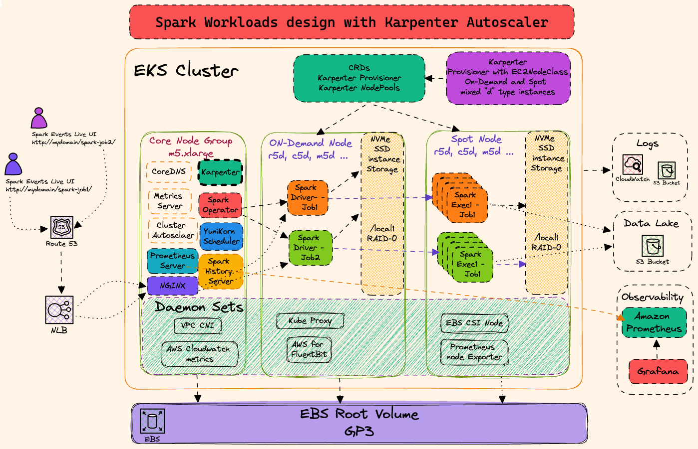
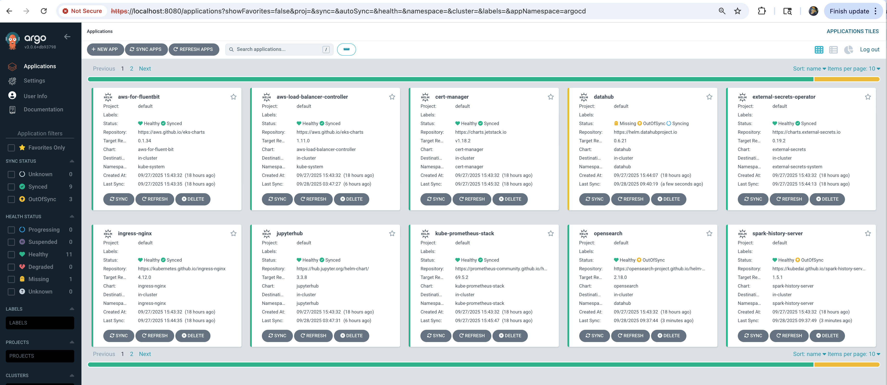

# Spark on EKS Infrastructure

Deploy a production-ready Apache Spark platform on Amazon EKS with GitOps, auto-scaling, and observability.

## Architecture

This blueprint deploys Spark Operator on EKS with Karpenter for elastic node provisioning and ArgoCD for GitOps-based application management.



## Prerequisites

Before deploying, ensure you have the following tools installed:

- **AWS CLI** - [Install Guide](https://docs.aws.amazon.com/cli/latest/userguide/getting-started-install.html)
- **Terraform** (>= 1.0) - [Install Guide](https://developer.hashicorp.com/terraform/install)
- **kubectl** - [Install Guide](https://kubernetes.io/docs/tasks/tools/)
- **Helm** (>= 3.0) - [Install Guide](https://helm.sh/docs/intro/install/)
- **AWS credentials configured** - Run `aws configure` or use IAM roles

## Step 1: Clone Repository & Navigate

```bash
git clone https://github.com/awslabs/data-on-eks.git
cd data-on-eks/data-stacks/spark-on-eks
```

## Step 2: Customize Stack

Edit the blueprint configuration file to customize addons and settings:

```bash
# Edit configuration file
vi terraform/blueprint.tfvars
```

## Addons Configuration

The blueprint automatically deploys core infrastructure and platform addons. You only need to configure Spark-specific and optional addons.

To see all available addons and customize this stack, check `infra/terraform/variables.tf`.

```hcl title="terraform/blueprint.tfvars"
region = "us-west-2"
name   = "spark-on-eks"

#----------------------------------
# Required for Spark
#----------------------------------
enable_spark_operator = true
enable_spark_history_server = true

#----------------------------------
# Optional addons
#----------------------------------
enable_yunikorn = false             # Gang scheduling
enable_mountpoint_s3_csi = false    # High-performance S3 access
enable_flink = false                # Stream processing
enable_kafka = false                # Event streaming

#----------------------------------
# EKS Addons deployed by default
#----------------------------------
coredns                         = true
kube-proxy                      = true
vpc-cni                         = true
eks-pod-identity-agent          = true
aws-ebs-csi-driver              = true
metrics-server                  = true
eks-node-monitoring-agent       = true
amazon-cloudwatch-observability = true

#----------------------------------
# Default Addons deployed by default
#----------------------------------
karpenter
argocd
kube-prometheus-stack
external-secrets-system
cert-manager
enable_ingress_nginx
```

## Step 3: Deploy Infrastructure

Run the deployment script:

```bash
./deploy-blueprint.sh
```

:::note

**If deployment fails:**
- Rerun the same command: `./deploy-blueprint.sh`
- If it still fails, debug using kubectl commands or [raise an issue](https://github.com/awslabs/data-on-eks/issues)

:::

:::info

**Expected deployment time:** 15-20 minutes

:::

## Step 4: Configure kubectl & Verify

Update kubeconfig and verify deployment:

```bash
cd terraform/_local/

# Update kubeconfig
aws eks update-kubeconfig --region us-west-2 --name spark-on-eks

# Verify nodes
kubectl get nodes

# Verify core components
kubectl get namespaces
kubectl get applications -n argocd
```

<details>
<summary><strong>✅ Expected Verification Results (Click to expand)</strong></summary>

**Cluster Nodes:**
```bash
kubectl get nodes

# success-start
NAME                                          STATUS   ROLES    AGE   VERSION
ip-100-64-28-122.us-west-2.compute.internal   Ready    <none>   18h   v1.33.5-eks-113cf36
ip-100-64-57-46.us-west-2.compute.internal    Ready    <none>   18h   v1.33.5-eks-113cf36
ip-100-64-76-121.us-west-2.compute.internal   Ready    <none>   18h   v1.33.5-eks-113cf36
ip-100-64-98-68.us-west-2.compute.internal    Ready    <none>   18h   v1.33.5-eks-113cf36
# success-end
```

**ArgoCD Applications Status:**
```bash
# success-start
NAMESPACE                 NAME                                                              READY   STATUS
amazon-cloudwatch         amazon-cloudwatch-observability-controller-manager-6b5bdc5bch6n   1/1     Running
amazon-cloudwatch         cloudwatch-agent-hhptn                                            1/1     Running
amazon-cloudwatch         cloudwatch-agent-mwr8j                                            1/1     Running
amazon-cloudwatch         cloudwatch-agent-t27j4                                            1/1     Running
amazon-cloudwatch         cloudwatch-agent-zhxd5                                            1/1     Running
amazon-cloudwatch         fluent-bit-bg5sw                                                  1/1     Running
amazon-cloudwatch         fluent-bit-fzmhd                                                  1/1     Running
amazon-cloudwatch         fluent-bit-hr7vq                                                  1/1     Running
amazon-cloudwatch         fluent-bit-hszqv                                                  1/1     Running
argocd                    argocd-application-controller-0                                   1/1     Running
argocd                    argocd-applicationset-controller-68557bd74f-rczkb                 1/1     Running
argocd                    argocd-redis-7f855978d6-h7js5                                     1/1     Running
argocd                    argocd-repo-server-7986569554-6pcv6                               1/1     Running
argocd                    argocd-server-664456c54d-qsvjq                                    1/1     Running
cert-manager              cert-manager-cainjector-55cd9f77b5-8r2b7                          1/1     Running
cert-manager              cert-manager-d4f586975-ctk6p                                      1/1     Running
cert-manager              cert-manager-webhook-7987476d56-mwql5                             1/1     Running
external-secrets-system   external-secrets-operator-8465bfd6f7-7z2xs                        1/1     Running
external-secrets-system   external-secrets-operator-cert-controller-774cffdcb7-8lx95        1/1     Running
external-secrets-system   external-secrets-operator-webhook-5745d54555-m29gj                1/1     Running
ingress-nginx             ingress-nginx-controller-6dc8d7d55d-2bsvd                         1/1     Running
jupyterhub                hub-76bf869c99-lv88r                                              1/1     Running
jupyterhub                proxy-579b6c8b6d-n2rzs                                            1/1     Running
jupyterhub                user-scheduler-59ffc6c676-hvlcn                                   1/1     Running
jupyterhub                user-scheduler-59ffc6c676-lvlmv                                   1/1     Running
karpenter                 karpenter-67f7cdc578-jvv5j                                        1/1     Running
karpenter                 karpenter-67f7cdc578-qqd7x                                        1/1     Running
kube-prometheus-stack     kube-prometheus-stack-grafana-c4b7f8b8c-8dz45                     3/3     Running
kube-prometheus-stack     kube-prometheus-stack-kube-state-metrics-7f498cd54f-248hg         1/1     Running
kube-prometheus-stack     kube-prometheus-stack-operator-659dc79b7c-zlwpq                   1/1     Running
kube-prometheus-stack     kube-prometheus-stack-prometheus-node-exporter-gcj59              1/1     Running
kube-prometheus-stack     kube-prometheus-stack-prometheus-node-exporter-j85ct              1/1     Running
kube-prometheus-stack     kube-prometheus-stack-prometheus-node-exporter-kd72d              1/1     Running
kube-prometheus-stack     kube-prometheus-stack-prometheus-node-exporter-npx6x              1/1     Running
kube-prometheus-stack     prometheus-kube-prometheus-stack-prometheus-0                     2/2     Running
kube-system               aws-for-fluentbit-aws-for-fluent-bit-4d546                        1/1     Running
kube-system               aws-for-fluentbit-aws-for-fluent-bit-gx9kn                        1/1     Running
kube-system               aws-for-fluentbit-aws-for-fluent-bit-kmj2q                        1/1     Running
kube-system               aws-for-fluentbit-aws-for-fluent-bit-mnnwz                        1/1     Running
kube-system               aws-load-balancer-controller-576d947768-rqkkc                     1/1     Running
kube-system               aws-load-balancer-controller-576d947768-s8xvv                     1/1     Running
kube-system               aws-node-5m6dg                                                    2/2     Running
kube-system               aws-node-cqhnd                                                    2/2     Running
kube-system               aws-node-qcjhn                                                    2/2     Running
kube-system               aws-node-zwdgc                                                    2/2     Running
kube-system               coredns-7bf648ff5d-kxgsc                                          1/1     Running
kube-system               coredns-7bf648ff5d-wgfr4                                          1/1     Running
kube-system               ebs-csi-controller-9cd4474bd-fbckb                                6/6     Running
kube-system               ebs-csi-controller-9cd4474bd-n5vt8                                6/6     Running
kube-system               ebs-csi-node-5znsb                                                3/3     Running
kube-system               ebs-csi-node-dgqcb                                                3/3     Running
kube-system               ebs-csi-node-h6zsx                                                3/3     Running
kube-system               ebs-csi-node-hc4nt                                                3/3     Running
kube-system               eks-node-monitoring-agent-4vdb2                                   1/1     Running
kube-system               eks-node-monitoring-agent-9v66d                                   1/1     Running
kube-system               eks-node-monitoring-agent-cstll                                   1/1     Running
kube-system               eks-node-monitoring-agent-nzznb                                   1/1     Running
kube-system               eks-pod-identity-agent-77d52                                      1/1     Running
kube-system               eks-pod-identity-agent-hqzfm                                      1/1     Running
kube-system               eks-pod-identity-agent-ld449                                      1/1     Running
kube-system               eks-pod-identity-agent-svl6l                                      1/1     Running
kube-system               kube-proxy-df52p                                                  1/1     Running
kube-system               kube-proxy-jvrb4                                                  1/1     Running
kube-system               kube-proxy-ll7fx                                                  1/1     Running
kube-system               kube-proxy-tnlzj                                                  1/1     Running
kube-system               metrics-server-7fb96f5556-l67qh                                   1/1     Running
kube-system               metrics-server-7fb96f5556-qg4lg                                   1/1     Running
spark-history-server      spark-history-server-0                                            1/1     Running
spark-operator            spark-operator-controller-556ff74f5c-z6pbg                        1/1     Running
spark-operator            spark-operator-webhook-5d7ff45749-z94g4                           1/1     Running
yunikorn-system           yunikorn-admission-controller-6b86bc76b4-qs4wg                    1/1     Running
yunikorn-system           yunikorn-scheduler-85dc96ffbc-c2lt6                               2/2     Running
# success-end
```

**Spark Components:**
```bash
# Spark Operator
kubectl get pods -n spark-operator
# success-start
NAME                                         READY   STATUS
spark-operator-controller-556ff74f5c-z6pbg   1/1     Running   0          5h52m
spark-operator-webhook-5d7ff45749-z94g4      1/1     Running   0          5h52m
# success-end

# Spark CRDs
kubectl get crds | grep spark
# success-start
scheduledsparkapplications.sparkoperator.k8s.io         2025-09-27T22:46:45Z
sparkapplications.sparkoperator.k8s.io                  2025-09-27T22:46:45Z
# success-end
```

**Karpenter Node Pools:**
```bash
kubectl get nodepools -n karpenter
# success-start
NAME                         NODECLASS   NODES   READY   AGE
compute-optimized-graviton   default     0       True    3h7m
compute-optimized-x86        default     0       True    3h7m
general-purpose              default     0       True    3h7m
memory-optimized-graviton    default     0       True    3h7m
memory-optimized-x86         default     0       True    3h7m
# success-end
```

</details>

## Step 5: Access ArgoCD & Verify Addons

Access ArgoCD web UI to verify all addons:

```bash
# Port forward to ArgoCD
kubectl port-forward svc/argocd-server -n argocd 8080:443

# Get admin password
kubectl get secret argocd-initial-admin-secret -n argocd -o jsonpath="{.data.password}" | base64 -d
```

**Login Details:**
- **URL:** https://localhost:8080
- **Username:** admin
- **Password:** Use command above

**Verify in ArgoCD UI:**
- All applications should be "Synced" and "Healthy"
- Check: spark-operator, kube-prometheus-stack




## Step 6: Test with Simple Spark Job

Run a test Spark job to verify everything works:

```bash
cd data-stacks/spark-on-eks/terraform/_local/

# Export S3 bucket from Terraform outputs
export S3_BUCKET=$(terraform output -raw s3_bucket_id_spark_history_server)

# Navigate to blueprints directory
cd ../../blueprints/

# Replace S3 bucket placeholder in YAML file
envsubst < pyspark-pi-job.yaml | kubectl apply -f -

# Monitor job progress
kubectl get sparkapplications -n spark-team-a --watch

# Check logs
kubectl logs -n spark-team-a -l spark-role=driver --follow
```

**Expected Result:**
- Job completes successfully with Pi calculation
- Karpenter automatically provisions compute nodes
- Logs show successful Spark execution

```bash
kubectl get sparkapplications -n spark-team-a --watch

NAME                   STATUS      ATTEMPTS   START                  FINISH                 AGE
pyspark-pi-karpenter   COMPLETED   1          2025-09-28T17:03:31Z   2025-09-28T17:05:02Z   108s
```


## Troubleshooting

### Common Issues

**Pods stuck in Pending:**
```bash
# Check node capacity
kubectl describe nodes

# Check Karpenter logs
kubectl logs -n karpenter -l app.kubernetes.io/name=karpenter
```

**ArgoCD applications not syncing:**
```bash
# Check ArgoCD application status
kubectl get applications -n argocd

# Check specific application
kubectl describe application spark-operator -n argocd
```

## Next Steps

With infrastructure deployed, you can now run any Spark blueprint:

- [EBS PVC Storage](/data-on-eks/docs/datastacks/spark-on-eks/ebs-pvc-storage)
- [NVMe Storage](/data-on-eks/docs/datastacks/spark-on-eks/nvme-storage)
- [Graviton Compute](/data-on-eks/docs/datastacks/spark-on-eks/graviton-compute)
- [YuniKorn Gang Scheduling](/data-on-eks/docs/datastacks/spark-on-eks/yunikorn-gang-scheduling)

## Cleanup

To remove all resources, use the dedicated cleanup script:

```bash
# Navigate to blueprint directory
cd /path/to/data-on-eks/data-stacks/spark-on-eks

# Run cleanup script
./cleanup.sh
```

**If cleanup fails:**
- Rerun the same command: `./cleanup.sh`
- Keep rerunning until all resources are deleted
- Some AWS resources may have dependencies that require multiple cleanup attempts

**⚠️ Warning:** This will delete all resources and data. Make sure to backup any important data first.
